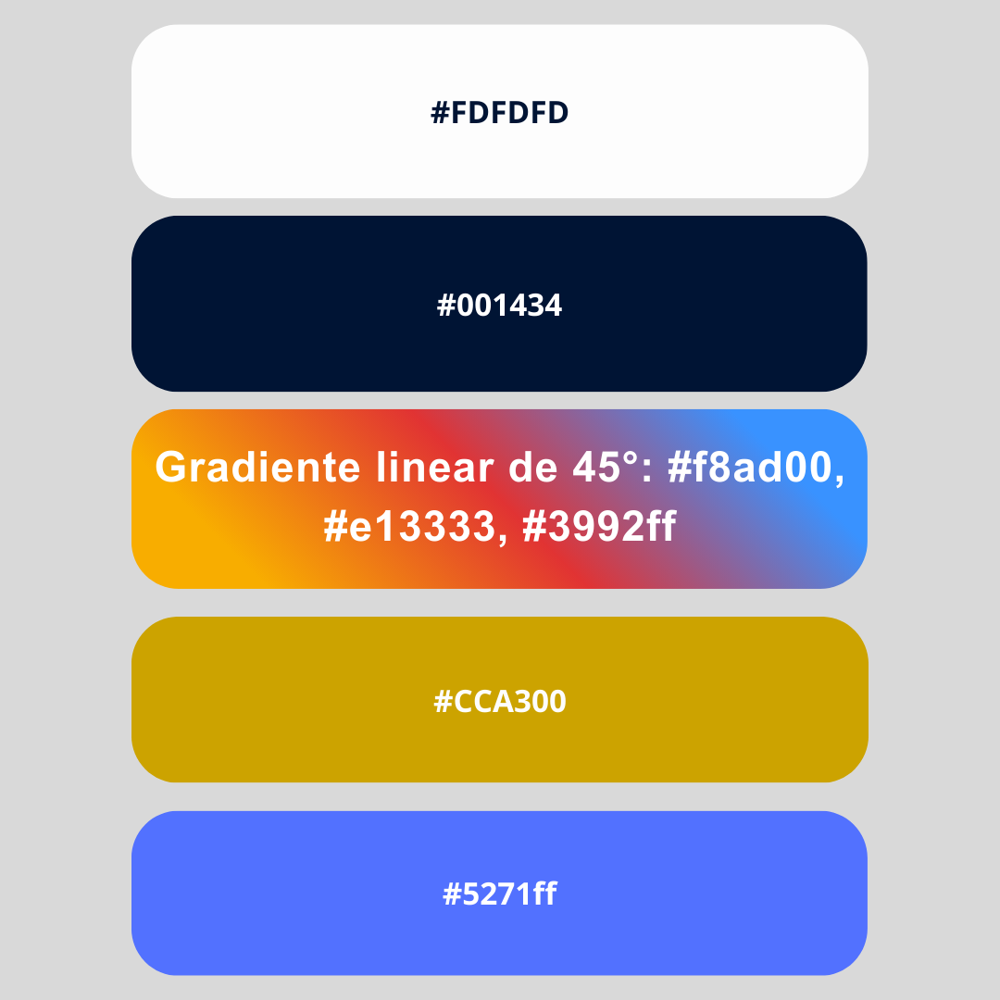

# orbent-brand-assets
# 🌌 Orbent Brand Assets

Repositório oficial de identidade visual e design system da **Orbent** — uma plataforma white-label que une tecnologia, inteligência e cultura organizacional.

---

## 🎨 Paleta Principal

| Cor | Hex | Uso |
|------|------|-----|
| Azul Orbent | `#001434` | Cor base / fundo principal |
| Azul Acento | `#5271FF` | Ação e interação |
| Dourado Orbent | `#CCA300` | Destaques e elementos premium |
| Branco Gelo | `#FDFDFD` | Fundo claro / contraste |

---

## 🧩 Estrutura

