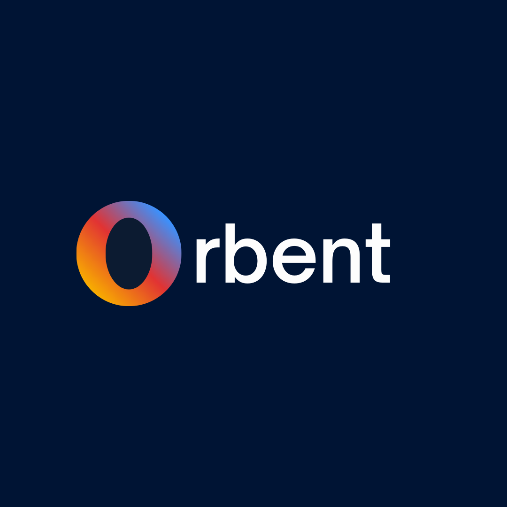

# 📘 Orbent – Style Guide Oficial

Este documento define a identidade visual e o design system da Orbent.  
Seu objetivo é garantir **consistência** em todos os produtos, dashboards, relatórios e comunicações da marca.

---

## 1. Identidade Visual

### Logotipos Oficiais
- **Logo Principal**
  - 
  - 

- **Logo Transparente**
  - 

- **Logo com Slogan**
  - 

### Ícones
- 
- 
- 

> 🔒 **Regras de uso**  
> - Manter proporção original.  
> - Espaço mínimo ao redor igual à altura do “O”.  
> - Nunca distorcer, rotacionar ou aplicar efeitos extras.  
> - Para white-label: aplicar marca do cliente à direita, mantendo “by Orbent”.

---

## 2. Paleta de Cores

| Nome               | Hex      | Uso Principal                        |
|--------------------|----------|--------------------------------------|
| Branco Gelo        | `#FDFDFD` | Fundos claros, contraste de texto.   |
| Azul Orbent        | `#001434` | Fundos institucionais, dashboards.   |
| Gradiente Orbent   | `linear 45°: #f8ad00 → #e13333 → #3992ff` | Ícone “O”, destaques premium. |
| Dourado Orbent     | `#CCA300` | Ênfase em botões, KPIs financeiros. |
| Azul Acento        | `#5271FF` | Links, CTAs secundários.            |

---

## 3. Tipografia

- **Fonte primária**: [Inter](https://fonts.google.com/specimen/Inter)  
- **Fonte secundária**: [Poppins](https://fonts.google.com/specimen/Poppins)  

**Regras:**
- Títulos H1/H2 → Poppins, bold  
- Texto corrido → Inter, regular/medium  
- Contraste mínimo AA (WCAG 2.1)  

---

## 4. Design System

### Componentes
- **Botões**: arredondados 8px, cores primárias (Azul Orbent / Gradiente).  
- **Cards**: fundo branco (#FDFDFD) ou azul Orbent (#001434) com sombra suave.  
- **Tabelas**: zebra striping em cinza claro, header bold.  
- **Badges**: gradiente Orbent para status ativos.  
- **Loaders**: animação circular em gradiente Orbent.  

### Acessibilidade
- Contraste mínimo: AA  
- Navegação por teclado  
- Foco visível em botões e links  

---

## 5. Linguagem & Tom

- **Slogan oficial**  
  *Visão sistêmica. Cultura viva. Inteligência com propósito.*  

- **Tom**: Institucional, premium, acessível.  

- **Aplicação**  
  - Interno → dashboards, relatórios, intranet.  
  - Externo → clientes, white-label “by Orbent”.  

---

## 6. Exemplos de Aplicação

- Login screen com logo Orbent no canto esquerdo.  
- White-label: Orbent à esquerda + marca do cliente à direita (“ACME by Orbent”).  
- Paleta aplicada em dashboards financeiros e relatórios ESG.  

---

## 7. Texturas & Patterns

Além das cores sólidas, a identidade Orbent utiliza **patterns exclusivos** para dar profundidade e consistência visual.

### Patterns Oficiais

1. **Orbent Pattern Colorido**  
   -   
   - Uso: fundos de destaque, apresentações, áreas premium.  

2. **Orbent Pattern com Opacidade**  
   -   
   - Uso: sobreposição em dashboards e relatórios, mantendo legibilidade.  

3. **Orbent Galáxia**  
   -   
   - Uso: aplicações conceituais, institucionais e de storytelling.  

> 🔒 **Regras de uso**  
> - Não distorcer ou alterar as proporções.  
> - Sempre aplicar com contraste suficiente para manter a legibilidade do texto.  
> - Usar como **background de apoio**, nunca como elemento principal.  

---

## 8. Governança

- **Repositório**: `orbent-brand-assets`  
- **Versionamento**: manter `logos/`, `icons/`, `palette/`, `patterns/` organizados.  
- **Exportações**: PNG/SVG para apps e web, PDF para apresentações.  

---

📌 **Resumo**  
Este style guide define logotipos, ícones, paleta, tipografia, design system, linguagem e padrões visuais para garantir **coerência e identidade forte** da marca Orbent.

